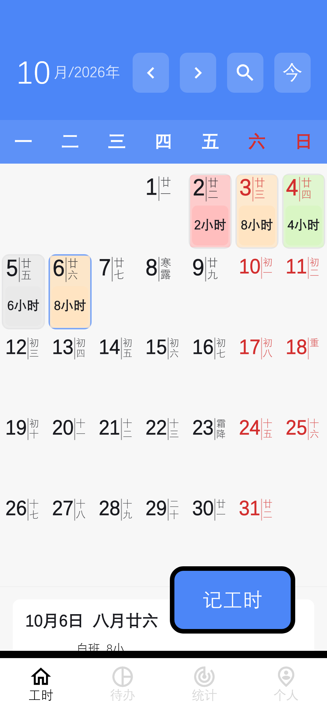
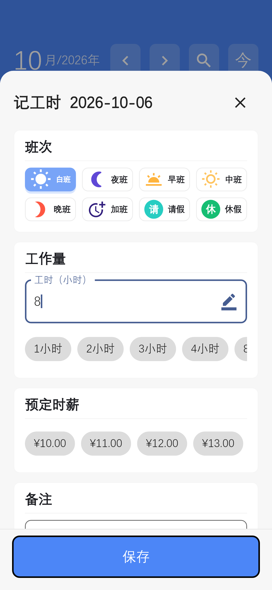
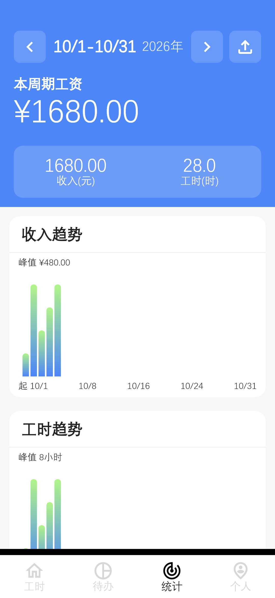
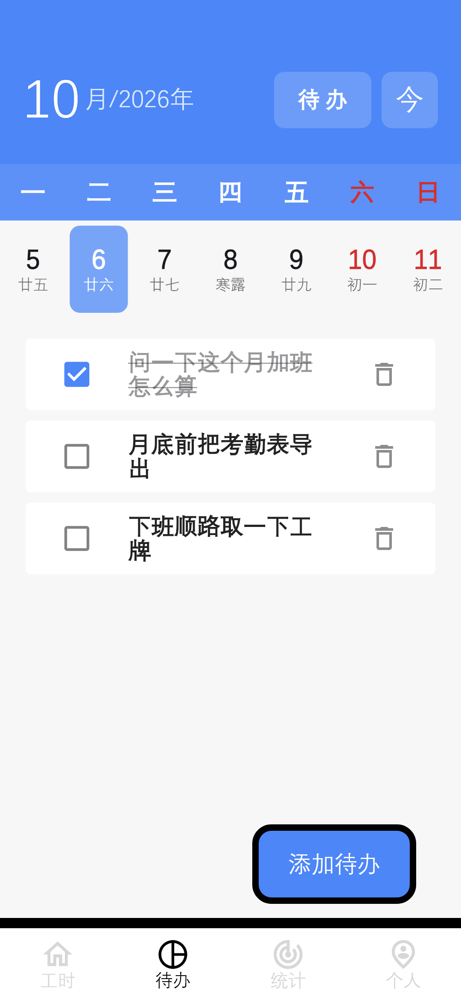
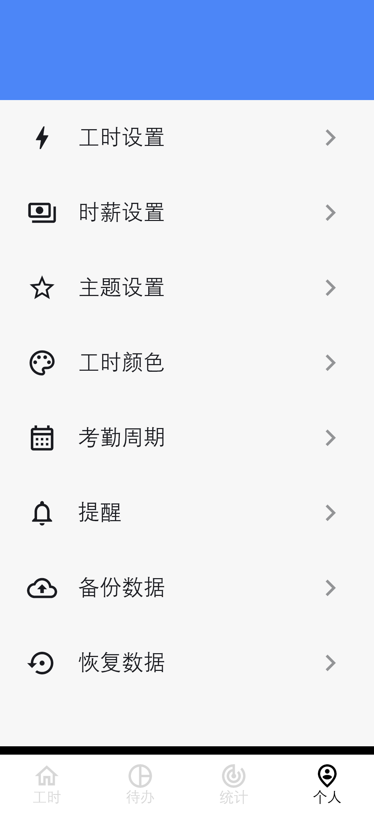

# 记工时

一款给按小时、按班次拿工资的人用的记工时 Android 应用。上班记一笔，月底打开统计页就能看到这个月干了多少小时、应该拿多少钱，对工资条的时候不用再翻聊天记录、回忆哪天加没加班。

所有数据只存在手机本地，不需要注册登录，也没有任何联网功能。

## 长什么样

打开应用就是日历，哪天干了活一目了然：



点右下角「记工时」，选班次、填小时数，两秒记完一笔：



统计页按考勤周期自动汇总这个周期的收入和总工时，还能看每天的趋势：



待办跟着日期走，交接班要注意什么、哪天要去办事，记在当天就不会忘：



时薪、班次颜色、主题、提醒都可以按自己的习惯调整：



## 能干什么

**早上到工位点一下，记一笔。** 打开应用就是当天的日历，点「记工时」选个班次（白班、夜班、加班这些），工时可以手填也可以点快捷按钮，保存就完事。哪天忘了记，点日历上任何一天都能补录。

**月底看这个月挣了多少。** 统计页把整个考勤周期的工时和收入汇总好，应得多少钱直接写在最上面，还有每天的收入趋势图。发工资那天打开对一眼，少了一眼就能看出差在哪几天。

**忘了哪天加没加班，翻日历。** 日历上每天标着班次颜色和小计时数，农历也一并显示，翻到哪天看到哪天，不用再去翻微信记录或者问工友。

**顺手记事。** 每天一个待办清单，记一句「问一下加班怎么算」「月底前导出考勤表」，做完打个勾。

**换手机数据不丢。** 设置里一键备份全部数据到文件，新手机上恢复即可；也支持每天固定时间提醒你补记当天工时。

## 下载安装

到 [Releases](https://github.com/AnonymoAcX/work-helper-timesheet/releases/latest) 下载最新的 APK 安装包，传到手机上直接安装即可（需要 Android 7.0 及以上；首次安装时系统会提示允许安装来自此来源的应用，按提示授权即可）。数据全部保存在手机本地，卸载应用即删除，请按需使用应用内的「备份数据」功能导出备份。

## 从源码构建

需要先安装 Flutter SDK（要求见 `pubspec.yaml`），然后在项目根目录执行：

```bash
# 拉取依赖
flutter pub get

# 连接设备或启动模拟器后运行
flutter run

# 构建发布包
flutter build apk --release
```

运行测试：

```bash
flutter test
```

## 界面截图如何生成

仓库里的截图由 `test/screenshot_test.dart` 在测试环境渲染真实页面生成（内存数据库注入演示数据，1080×2340）。需要更新截图时，在装有所需字体的开发机上运行：

```bash
flutter test --update-goldens test/screenshot_test.dart
```

然后把 `build/screenshot-raw/` 下生成的 PNG 复制到 `screenshots/` 覆盖同名文件。该测试在其他环境会自动跳过，不影响普通 `flutter test`。

## 许可证

MIT，详见 `LICENSE`。
